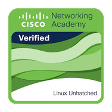
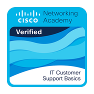

<!-- Profile README — shown on https://github.com/dan-calin -->

# Hi, I'm Dan Calin 👋

> I build practical software with AI, while developing the engineering judgment
> needed to use AI responsibly.

I'm a developer focused on **AI-assisted development**, useful automation, and
products that solve real problems. I use AI to move faster across research,
implementation, debugging, testing, and review—but I do not treat generated
code as automatically correct.

My projects are designed to demonstrate more than technical output. They show
how I approach unclear problems, challenge assumptions, protect against failure,
and carry an idea through to documentation, testing, packaging, and public
release.

- **AI literacy:** choosing where AI helps, where human judgment matters, and
  how to verify the result
- **Engineering mindset:** critical thinking, threat modelling, failure testing,
  redundancy, and attention to detail
- **Product focus:** making technically complex tools understandable and useful
  to real people
- **Open to:** software-development opportunities, collaboration, feedback, and
  thoughtful technical conversations

---

## Featured Projects

| Project | What it does | What it demonstrates |
| --- | --- | --- |
| **[Carry](https://github.com/dan-calin/carry)** | An open-source Windows app for safely syncing project folders and shared AI-agent memory between trusted computers. It protects work with conflict handling, recovery checkpoints, and careful failure testing. | Product development · Security thinking · Reliability · Tauri · Node.js · CI/CD |
| **[Shared Agent Memory](https://github.com/dan-calin/shared-agent-memory)** | One shared, local memory and coordination layer for multiple AI coding agents. Claude Code, Codex, Cursor, Windsurf, Gemini CLI, Aider, and other MCP-capable tools can reuse context and coordinate file edits across sessions. | MCP · Agent orchestration · Developer tooling · Node.js |
| **[Sentinel](https://github.com/dan-calin/sentinel)** | A safety-first Linux assistant that turns plain English into one proposed terminal command, filters destructive operations, and requires human approval before anything runs. | Python · LLM APIs · Guardrails · Human-in-the-loop design |
| **[Miko](https://github.com/dan-calin/miko)** | A Windows voice assistant powered by Gemini Live that can work with the PC, Discord, the web, and local files. It also exposes tools that other agents can call. | Voice AI · Tool calling · FastAPI · Automation · Python |
| **[Beta Testing App](https://github.com/dan-calin/beta-testing-manager)** | A Windows overlay for beta testers to manage test lists, capture OBS timestamps, and keep useful controls visible while testing another application. | Desktop UX · MVC architecture · OBS WebSocket · Supabase · Python |

---

## How I work with AI

I treat AI as a capable development partner, not autopilot. My usual workflow
looks like this:

1. **Define the real problem** and the behaviour the product needs to guarantee.
2. **Use AI to accelerate exploration and implementation** while keeping control
   of architecture and trade-offs.
3. **Challenge the result** with edge cases, security questions, interrupted
   workflows, corrupt inputs, and tests that try to prove it wrong.
4. **Add redundant protection** where failure could damage user data or trust.
5. **Finish the product work** through accessibility, documentation, packaging,
   release automation, and honest limitations.

This is the kind of AI literacy I want my portfolio to show: knowing how to get
value from AI while remaining accountable for the outcome.

---

## Tech & Tools

**AI / LLMs:**

LLM APIs · Tool calling · MCP · AI agents · AI-assisted development

---

## Certifications

<table>
  <tr>
    <td align="center" valign="top" width="25%">
      
       
      <strong>CompTIA Tech+ Certification</strong>
       
      CompTIA
       
      <a href="https://www.credly.com/badges/306b8874-8b7f-4f3e-8dbe-c370bda936d0/public_url">View credential ↗</a>
    </td>
    <td align="center" valign="top" width="25%">
      
       
      <strong>Google IT Support &nbsp;</strong>
       
      Coursera · Google
       
      <a href="https://www.credly.com/badges/805a0330-88e5-44ed-b9e6-c992748f878d/public_url">View credential ↗</a>
    </td>
    <td align="center" valign="top" width="25%">
      
       
      <strong>Linux Unhatched &nbsp;</strong>
       
      Cisco Networking Academy
       
      <a href="https://www.credly.com/badges/20642e17-7269-4fc1-9e41-4e9131a22987/public_url">View credential ↗</a>
    </td>
    <td align="center" valign="top" width="25%">
      
       
      <strong>IT Customer Support Basics</strong>
       
      Cisco Networking Academy
       
      <a href="https://www.credly.com/badges/26d19e97-e528-4b5d-be59-a6e034590aa1/public_url">View credential ↗</a>
    </td>
  </tr>
</table>

---

## GitHub Snapshot

---

## Let's Connect

I'm actively building, learning, and looking for opportunities where practical
AI literacy, product thinking, and careful software development are valued.

If you have feedback on one of my projects, a code-review observation, a
question about my process, or a role that may be a good fit, I would be glad to
hear from you on [LinkedIn](https://www.linkedin.com/in/dancalin09/) or by
[email](mailto:dancalin09@gmail.com).

⚡ This profile evolves with every project I build and every assumption I learn to test.
